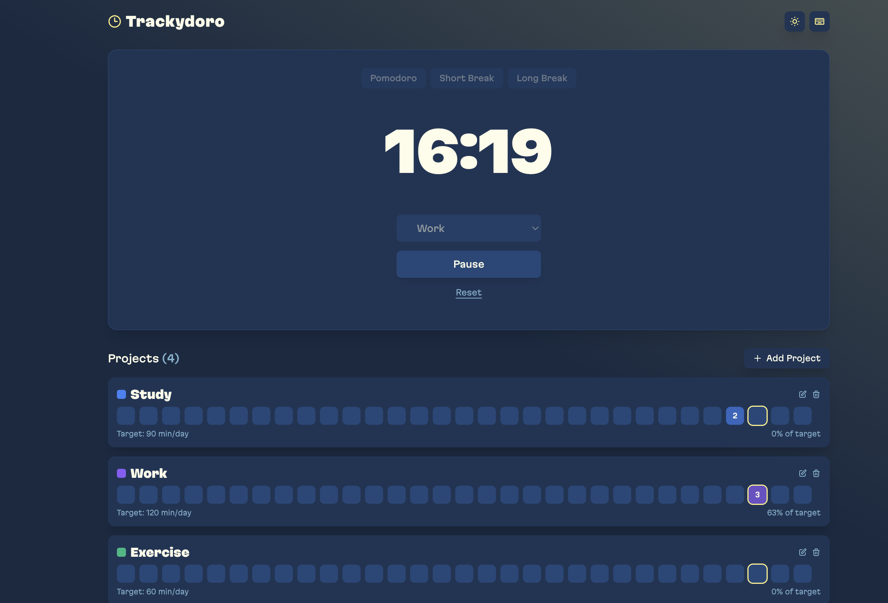

# Trackydoro

A beautiful and modern Pomodoro timer combined with visual habit tracking. Track your focus time, build consistent habits, and achieve your goals with an intuitive interface inspired by GitHub's contribution graph.




## ✨ Features

- 🍅 **Pomodoro Timer**: Stay focused with 25-minute work sessions and break intervals
- 📊 **Visual Progress Tracking**: GitHub-style activity squares show your daily progress
- 🔄 **Session Persistence**: Resume your timer exactly where you left off, even after closing the browser
- 🎯 **Category management**
- 📱 **Responsive Design**
- 🌓 **Theme System**: Beautiful light and dark themes with smooth transitions
- 🎨 **Custom Colors**: Personalise categories with your preferred colors

### Timer Features

- ⏱️ Work sessions (25 minutes)
- ☕ Short breaks (5 minutes)
- 🌴 Long breaks (15 minutes after 4 pomodoros)
- 🔊 Audio notifications for session completion
- ⏸️ Pause/Resume functionality
- 🔄 Session state persistence across page reloads

## 📝 Available Scripts

```bash
bun run dev          # Start development server
bun run build        # Build for production
bun run start        # Start production server
bun run lint         # Run ESLint
bun run lint:fix     # Fix ESLint errors
bun run format       # Format code with Prettier
bun run format:check # Check code formatting
```

## 🛠️ Tech Stack

- **[Next.js 15.4.2](https://nextjs.org/)** - React framework with App Router
- **[React 19](https://react.dev/)** - Latest React with improved performance
- **[TypeScript 5](https://www.typescriptlang.org/)** - Type-safe development
- **[Tailwind CSS v4](https://tailwindcss.com/)** - Modern utility-first CSS
- **[date-fns](https://date-fns.org/)** - Modern JavaScript date utility library
- **[Zustand](https://zustand-demo.pmnd.rs/)** - A small, fast and scalable bearbones state-management solution

### Manual Deployment

1. Build the application:

```bash
bun run build
```

2. Start the production server:

```bash
bun run start
```

### Environment Variables

No environment variables are required for basic functionality. All data is stored locally in the browser.

## 💾 Data Storage

Trackydoro uses browser localStorage to persist:

- Timer state and current session
- Categories and their settings
- Daily progress and statistics
- Theme preference

## 🤝 Contributing

We love your input! We want to make contributing to Trackydoro as easy and transparent as possible, whether it's:

- 🐛 Reporting a bug
- 💡 Discussing the current state of the code
- 🔧 Submitting a fix
- 🚀 Proposing new features
- 👩‍💻 Becoming a maintainer

### Reporting Bugs

We welcome your feedback. Use the /bug command to report issues directly within Trackydoro, or file a [GitHub issue](https://github.com/codeplaygroundspace/trackydoro/issues).

### Development process

- Fork the repo and create your branch from main
- If you've added code that should be tested, add tests
- If you've changed APIs, update the documentation
- Ensure the test suite passes
- Make sure your code lints
- Issue that pull request!

## 📄 License

This project is licensed under the MIT License - see the LICENSE file for details.
